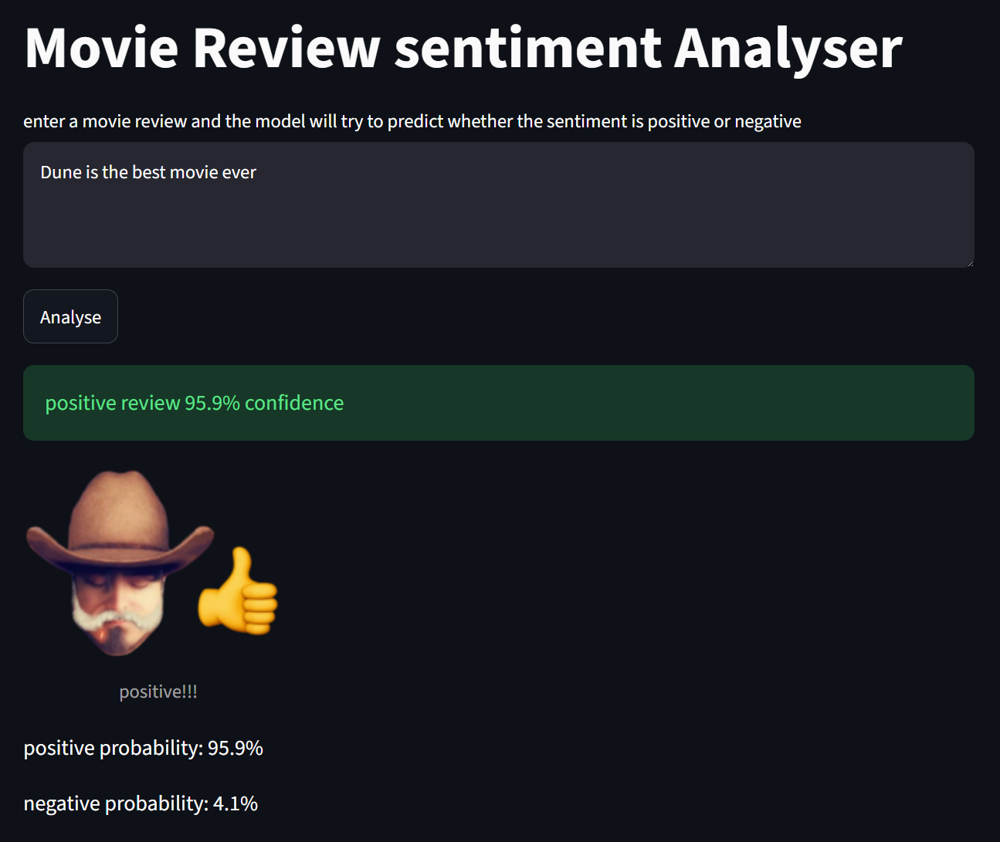

# Sentiment-Analysis-nlp
A small NLP project that classifies movie reviews as either positive or negative.
The project uses the IMDb Large Movie Review Dataset and a logistic regression classifier trained on TFIDF features.

Streamlit link: https://sentiment-analysis-nlp-haiden.streamlit.app/

## FEATURES: 
- loads and labels IMDB movie reviews
- removes basic HTML tags from the review text
- converts text into TFIDF features
- uses unigram and bigrams
- trains a logistic regression model
- displays accuracy, precision, recall and f1 score
- includes a streamlit interface for testing custom reviews
- shows prediction confidence
- funny reaction image to predictions :p

## MODEL: 
[The current model]
TF IDF vectorisation
unigrams and bigrams
min_df=2
sublinear term frequency 
logistic regression with C=2

the dataset is split into 20,000 training reviews and 5000 test reviews

the current test accuracy is approximately:
89.3%

## DATASET:
This project uses the standford IMDb Large Movie Review Dataset.
the dataset contains positive and negative movie reviews stored as individual text files.
the dataset itself is not included in this repo.
to run the training script, download the dataset and place it inside:

data/aclImdb/

The training data should then be located at:

data/aclImdb/train/pos 
data/aclImdb/train/neg

##RUNNING THE PROJECT:

Create and active a Python virtual environment, then istall the dependencies
```bash
pip install -r requirements.txt
```
Train the model
```bash
python Sentimnt_model.py
```
run the Streamlit interface
```bash
streamlit run app.py
```
## RESULTS:
The current model achieved below:
accuracy: 89.3%
negative precision: 90%
negative recall: 88%
positive precision: 88%
positive recall: 91%

during testing i figured the model also can still struggle with reviews containing sarcasm or any mixed sentiment.

## IMPROVEMENTS:
- Some improvements would be
- comparing the current model with a transformer based model
- improving preprocessing
- testing different model parameters
- improving the interface (nt removing images)
- analysing misclassifed reviews to improve model

## TECHNOLOGIES 
Python
pandas
scikit-learn
Streamlit
joblib

